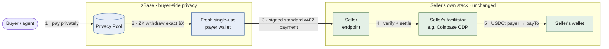
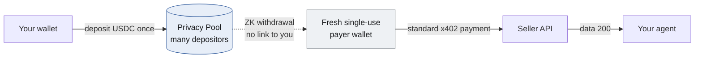
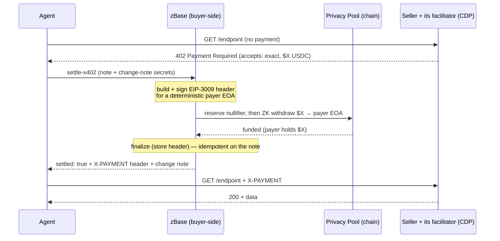
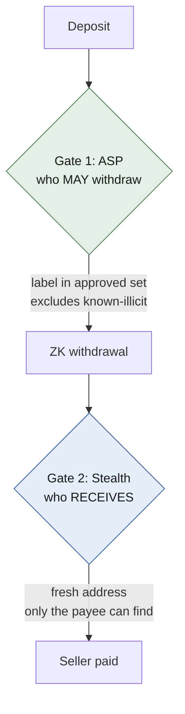
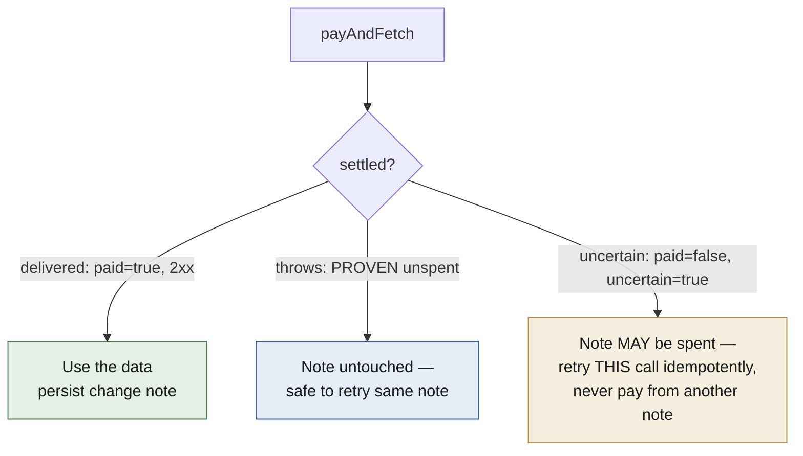
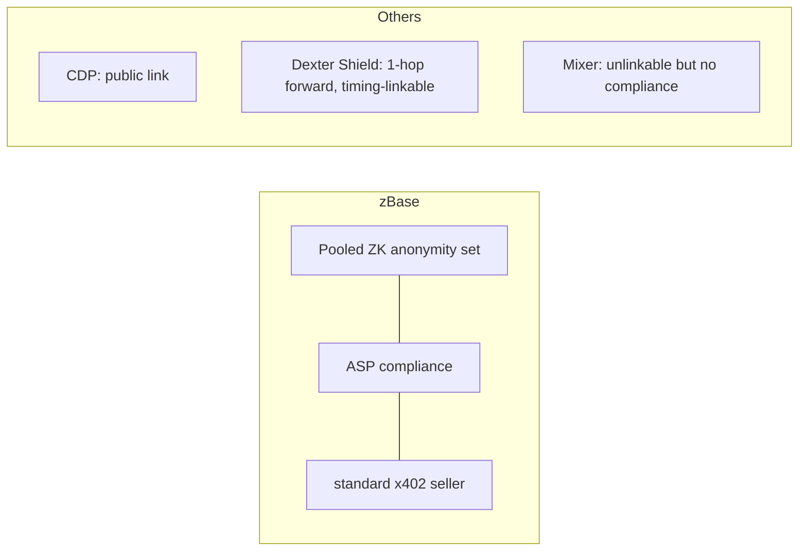

# How zBase works (diagrams)

The whole system in pictures. If you read nothing else, read this page.

## Does zBase replace Coinbase?

**No — a private payment uses both, in sequence.** zBase handles the **buyer-side**
privacy step: it funds a fresh, single-use payer wallet from a shared pool. The seller
keeps its **existing** x402 facilitator (commonly Coinbase CDP) to verify and settle the
payment.

!!! question "Wait — isn't zBase a facilitator?"
    Yes. zBase *is* an x402 facilitator, and it exposes facilitator endpoints. But a
    seller does **not** have to switch to it: in the private-payment flow, zBase acts as
    the **buyer's** wallet, funding a standard x402 payment that the seller settles through
    **its own** facilitator. Sellers keep their setup; zBase just makes the buyer private.

Read it left to right: the **blue** box is zBase (buyer-side privacy); the **green**
box is the seller's existing stack — its facilitator (e.g. Coinbase CDP) and wallet —
*unchanged*. The thick arrow (step&nbsp;3) is the handoff: the fresh payer wallet's
**standard** x402 payment goes to the **seller first**, and the seller's own facilitator
then verifies and settles it. zBase sits *before* that — it never has to become the
seller's facilitator and never touches their verification or settlement.

1. The buyer asks zBase to make a private payment.
2. zBase withdraws the exact amount from the privacy pool to a fresh payer wallet.
3. That wallet signs a standard x402 payment and the agent sends it to the seller.
4. The seller's existing facilitator (e.g. Coinbase CDP) verifies and settles it.
5. USDC lands in the seller's wallet, and the seller returns its data or goods.

So the payment routes through zBase **before** the seller's facilitator, not **instead
of** it — the seller does not need to replace or reconfigure anything.

## The one-picture version

Your agent pays an API. Normally that payment is a public receipt linking **your wallet → the API**.
zBase is *designed* to break that link: you deposit once into a shared pool, and each payment is
funded through a **fresh single-use wallet** drawn from the pool with a zero-knowledge proof. The
seller is paid with a standard x402 payment that carries **no zBase-specific marker** — though the
pool-funding deposit is itself a public on-chain transaction.

The public chain sees "a deposit" and, later, "some fresh wallet paid a seller." The ZK proof hides
*which* deposit funded the payer, and the anonymity set is the crowd you hide in.

!!! warning "Where this is today (open pilot)"
    These diagrams show the design. In the current open pilot the pool's anonymity set is still
    **below the k=30 threshold** — the runtime reports `customerReady: false` — so a payment is
    unlinkable *by construction* but **not yet crowd-private**; treat the privacy as best-effort
    until the set fills. The fresh-wallet-per-payment property holds for the `payAndFetch` path; the
    fixed-address `createZBasePrivateAccount` adapter reuses **one** payer address by design.

## A payment, step by step

The note is spent **once**. If the response is lost, a retry replays the same payment (idempotent on
the note) instead of paying twice — see the tri-state below.

## The two gates (why privacy + compliance coexist)

zBase runs two independent gates. Break one and a payment still isn't unmasked.

**Gate 1 (ASP / Association Sets)** proves your funds are *not* in the set of known-illicit deposits
— compliance without revealing which deposit is yours. **Gate 2 (stealth addresses)** hides the
recipient. This is why zBase is a *Privacy Pool*, not a blind mixer.

## The result you must handle (money-safety)

Every payment resolves to exactly one of three states. Never treat "unknown" as "unspent."

Full contract: [Developer Guides](developer-guides.md#the-result-contract-you-must-handle-money-safety).

## Where this sits vs the alternatives

See [How zBase compares](how-zbase-compares.md) for the full breakdown, including Dexter Shield.
