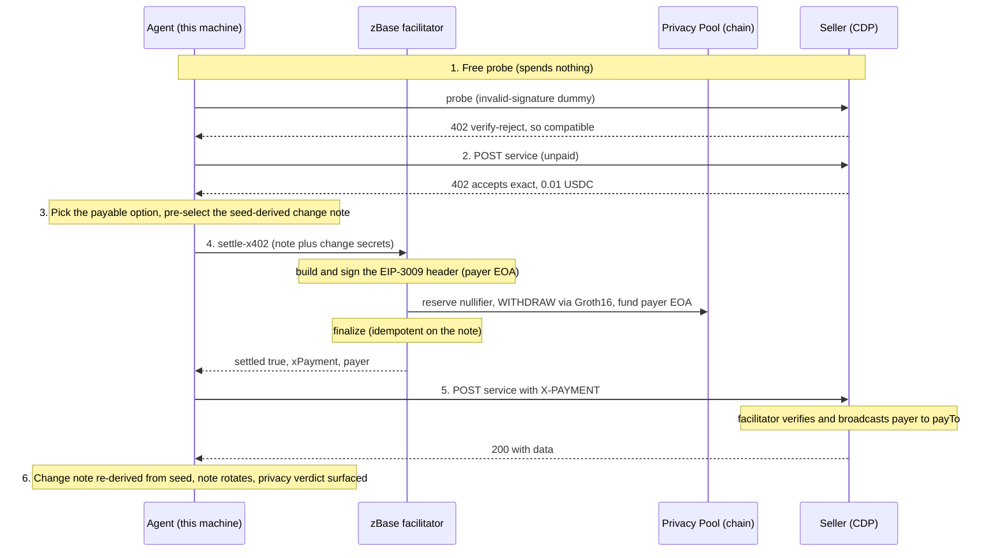

# Proven full flow: a private x402 payment (mainnet)

**Date:** 2026-07-20 · **Network:** Base mainnet (`eip155:8453`) · **App:** `zbase.app`

A single agent command paid a real x402 service **privately** — funded from a Privacy-Pool note via a
Groth16 ZK withdrawal, paid by a fresh single-use EOA, and got the seller's data back (HTTP 200). The
walked example below is a **$0.01 Nansen** call; a **$0.001 MetaLend** call is shown right after it.
Both use the actual values from the runs.

## The service

`POST https://api.nansen.ai/api/v1/token-screener` — Nansen's token screener (top movers across
chains). CDP-facilitated, `exact` scheme, price **10000 atomic USDC = $0.01**. It's a `POST`
endpoint, so the pay switches to POST with a JSON body.

## One command

```bash
cd packages/mcp
npx tsx run.ts pay https://api.nansen.ai/api/v1/token-screener 0.05 --pilot \
  --body '{"chains":["base","ethereum","solana"],"timeframe":"24h"}'
```

- `0.05` is the max the agent will pay (a ceiling; the actual price 0.01 is read from the 402).
- `--body` switches the request to **POST** (Nansen's screener is `POST`, not `GET`).
- `--pilot` acknowledges the open-pilot NOT-private disclosure (the pool's anonymity set is below the
  k=30 minimum today, so the payment settles but is not yet crowd-anonymous — see step 6).

Result:

```json
{ "paid": true, "delivered": true, "status": 200,
  "payer": "0x17fF45F0320d278EDA13989eE95Ad69fbF0C325d",
  "amountUSDC": "0.01",
  "fundingTxHash": "0x9cabc38638b340a5d248bff822e97ab731df64d611d595df220040893811f548",
  "response": { "result": [
    { "chain": "base", "token_symbol": "🌱 OPENAI", "market_cap_usd": 10052097.94,
      "volume": 49448543.27, "netflow": 4917886.26 } ],
    "pagination": { "page": 1, "per_page": 10, "is_last_page": false } },
  "changeNote": { "valueUSDC": "0.772996", "recoverable": true },
  "privacy": { "private": false, "anonymitySet": 2, "minimumForPrivacy": 30, "disclosure": "..." } }
```

## The full flow, step by step



**1 — Free probe (spends nothing).** Before touching a note, the SDK sends an invalid-signature
dummy payment. A real CDP verifier rejects it with a verify error (compatible); a bespoke
facilitator returns a generic 402 (incompatible, refuse for free). Nansen probed **compatible**.
For contrast, `api.getsly.ai/x402/demo/poem` probed **incompatible** and was refused without spending
— the probe working as designed. The probe is advisory: a false-compatible costs no more than paying
without one.

**2 — 402 challenge.** The seller answers the unpaid POST with `402` and an `accepts` array. zBase
selects the `exact` / USDC / $0.01 / Base entry.

**3 — Change note pre-selected.** The SDK derives the next (change) note's secrets from THIS note's
secrets (`deriveChangeNote`) and forwards them to the facilitator. The change is a pure function of
the spent note's seed, so a lost response is a re-derivation, not a loss.

**4 — Settle = withdraw from the pool (the note is spent here).** `POST /api/facilitator/settle-x402`:
- Builds and signs the standard EIP-3009 `X-PAYMENT` header for a deterministic single-use payer EOA
  (`0x17fF…325d`) — **before** any withdrawal, so a build failure leaves the note unspent.
- Reserves the note's `nullifier` in Redis (idempotency lease), then **withdraws** the exact amount
  from the Privacy Pool via a Groth16 ZK proof, funding the payer EOA. This is the last mutating step.
- Finalizes the lease with the built header, so a lost-response retry replays the same header instead
  of withdrawing twice.

**5 — Deliver.** The SDK re-sends the POST with the `X-PAYMENT` header (and `Payment-Signature`, so it
works whether the seller reads x402 v1 or v2 transport). The seller's CDP facilitator verifies the
EIP-3009 authorization, broadcasts `payer → payTo`, and returns **200 + data**.

**6 — Change + privacy verdict.** The note rotates to the seed-derived change note; the response carries
the honest privacy verdict for THIS payment.

## Proof it happened

| | value |
|---|---|
| Balance before | **0.782996 USDC**, 1 spendable note, 17 spent |
| Balance after | **0.772996 USDC**, 1 spendable note, 18 spent |
| Delta | **exactly 0.010000 USDC**, +1 spent note |
| Payer EOA | `0x17fF45F0320d278EDA13989eE95Ad69fbF0C325d` (single-use, no on-chain link to the depositor) |
| `fundingTxHash` | `0x9cabc38638b340a5d248bff822e97ab731df64d611d595df220040893811f548` (public on-chain) |
| Delivery | HTTP 200, Nansen token-screener data (top movers across Base/Ethereum/Solana) |

The wallet holds **no note file** — every note (including the change from this pay) is re-derived from
the seed plus on-chain commitments. That is why `spentNotes` went 17 → 18 and the spendable balance
dropped by exactly the price. Nansen never learns zBase was involved: it sees a standard EIP-3009
`exact` payment from a fresh address and delivers as it would for any CDP payer.

## Also proven: MetaLend ($0.001, GET)

The same flow, a cheaper CDP-facilitated seller, run on Base mainnet 2026-07-20 (app `@3d11020`).

**The service** — `GET https://api.metalend.tech/v1/services`, MetaLend's public API directory.
CDP-facilitated, `exact` scheme, price **1000 atomic USDC = $0.001**. Chosen from 1,077 services
priced at exactly $0.001 on Base in the x402 bazaar.

**One command** —

```bash
npx tsx run.ts pay https://api.metalend.tech/v1/services 0.002 --pilot
```

`0.002` is the ceiling; the actual $0.001 is read from the 402. No `--body` — it's a `GET`.

**Result** —

```json
{ "paid": true, "delivered": true, "status": 200,
  "payer": "0x7C2C8709BbB780ae8FCC087707c4F5C45b0b0B0F",
  "response": { "description": "MetaLend public API services directory ..." },
  "privacy": { "private": false, "anonymitySet": 2, "minimumForPrivacy": 30, "disclosure": "..." } }
```

It runs the **same 6-step flow above** — the only difference is a GET with no body.

**Proof** — balance **0.784996 → 0.783996 USDC** (exactly 0.001 spent, `spentNotes` 15 → 16), payer
`0x7C2C…0B0F` (single-use), delivery HTTP 200 + the MetaLend services directory JSON.

## Money-safety guarantees behind this flow

The note is spent only on `settled:true`. A lost or ambiguous settlement is reported as **uncertain**
(never a false "unspent"), so a retry replays the same header rather than paying again from the change
note. Settlement is idempotent on the note's `nullifier` (Redis lease + on-chain `nullifierHashes`
backstop). The change note is always seed-recoverable. See
`docs/strategy/settlement-idempotency-spec-2026-07-20.md`.

## Reproduce

```bash
cd packages/mcp
npx tsx run.ts probe https://api.nansen.ai/api/v1/token-screener \
  --body '{"chains":["base"],"timeframe":"24h"}'                   # compatible? price?
npx tsx run.ts balance                                             # before
npx tsx run.ts pay https://api.nansen.ai/api/v1/token-screener 0.05 --pilot \
  --body '{"chains":["base","ethereum","solana"],"timeframe":"24h"}'
npx tsx run.ts balance                                             # after: note spent, change re-derived
```

If a deposit/withdrawal happened just before, hit `deploy/cron-hit.sh mainnet indexer-sync` first, or
the withdraw refuses with "indexer state tree is cold."

## Settlement receipt in the pay output

The MCP `pay-privately` tool surfaces the settlement receipt directly, so the flow is observable from
the pay output alone (not only via a follow-up `balance`):

```json
{ "paid": true, "delivered": true, "status": 200,
  "amountUSDC": "0.01",
  "fundingTxHash": "0x9cabc38638b340a5d248bff822e97ab731df64d611d595df220040893811f548",
  "changeNote": { "valueUSDC": "0.772996", "recoverable": true },
  "payer": "0x17fF45F0320d278EDA13989eE95Ad69fbF0C325d" }
```

`fundingTxHash` and `amountUSDC` are public on-chain. The change note is summarised as **value +
recoverable only** — its bearer secrets (`secret`/`nullifier`) NEVER enter the tool output, since this
tool exists to keep secrets out of the conversation. The change is seed-recoverable, so there is
nothing to copy down.
