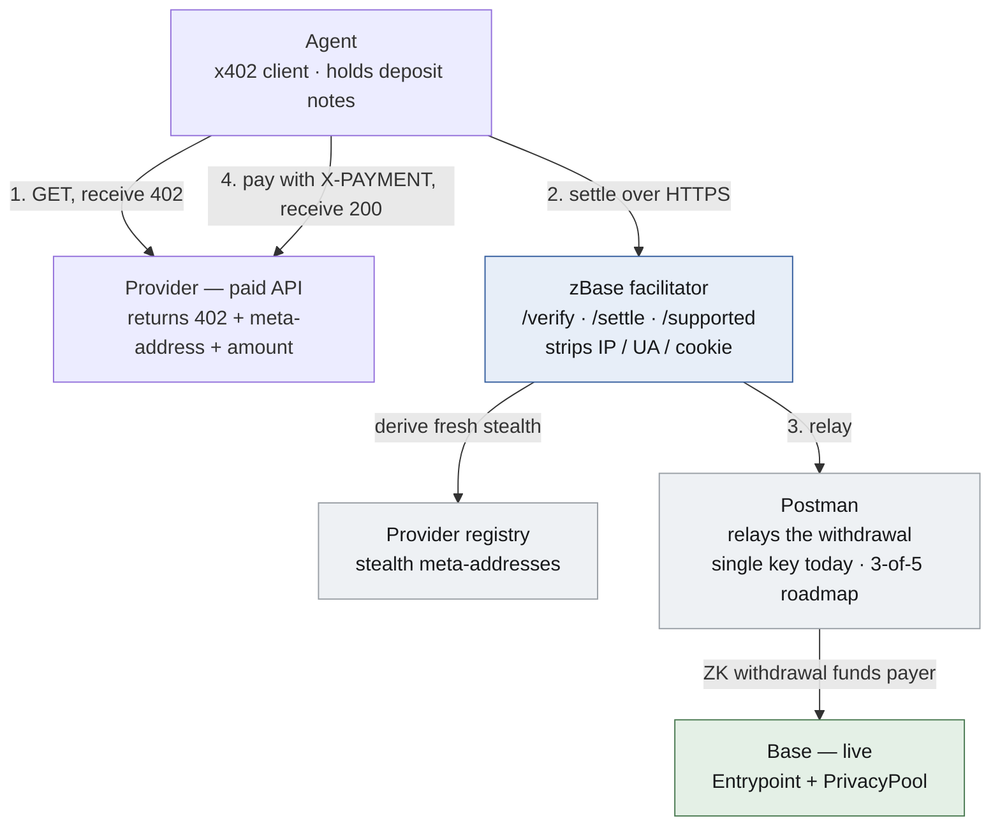
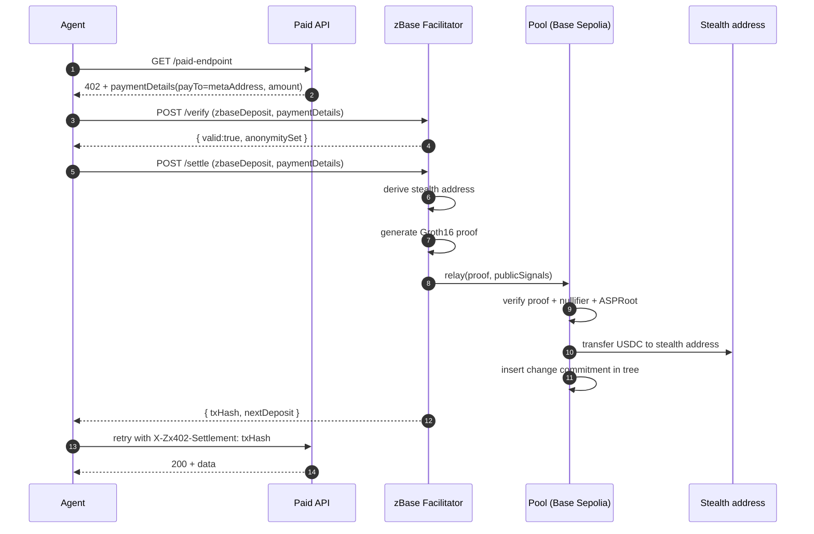

# System architecture

TL;DR — zBase is a facilitator app on Base (Solidity, plain 0xbow
PrivacyPool). Base mainnet is the current launch path; Base Sepolia is the
testnet path for development.

## High-level diagram

## Roles

| Role | Today | Roadmap |
|---|---|---|
| Agent | x402 client (any SDK) | Same |
| Facilitator | Next.js app, single host | Multiple hosts running same code |
| Postman | Single key (`0xcDB447...`) | 3-of-5 threshold (scaffolded) |
| ASP curator | Single off-chain risk pipeline | Diverse 5-signer panel (scaffolded) |
| Pool | Base mainnet single-value 0xbow PrivacyPool (live) | Wider anonymity set as it fills |
| Provider | EOA today | ERC-5564 meta-address after onboarding |

## The Base (EVM) stack

| Layer | Base |
|---|---|
| Contract runtime | Solidity |
| Proof verifier | Solidity Groth16 verifier |
| Indexing | HyperRPC + events |
| Settlement command | `relay()` |

The facilitator API (`/api/facilitator/supported`, `/verify`, `/settle`) is the stable
surface, live on Base mainnet.

## End-to-end settlement sequence

## Privacy boundaries summary

| Adversary | Defeated by | Layer |
|---|---|---|
| Direct payer→provider edge in single tx | Pool intermediary | Already live |
| FIFO timing correlation | Decoys + delay | Verified in dry-run |
| Facilitator-log IP/UA leak | Middleware | Live |
| Provider-side recipient correlation | Stealth | SDK + registry live |
| Single-postman censorship | 3-of-5 ASP | Scaffold — pre-signers |
| Day-1 thin pool | Seed | Plan validated |

For the audit-grade trust + threat tables read [Trust model](trust-model.md)
and [Threat model](threat-model.md).

Next → [The cryptographic core](cryptographic-core.md)
