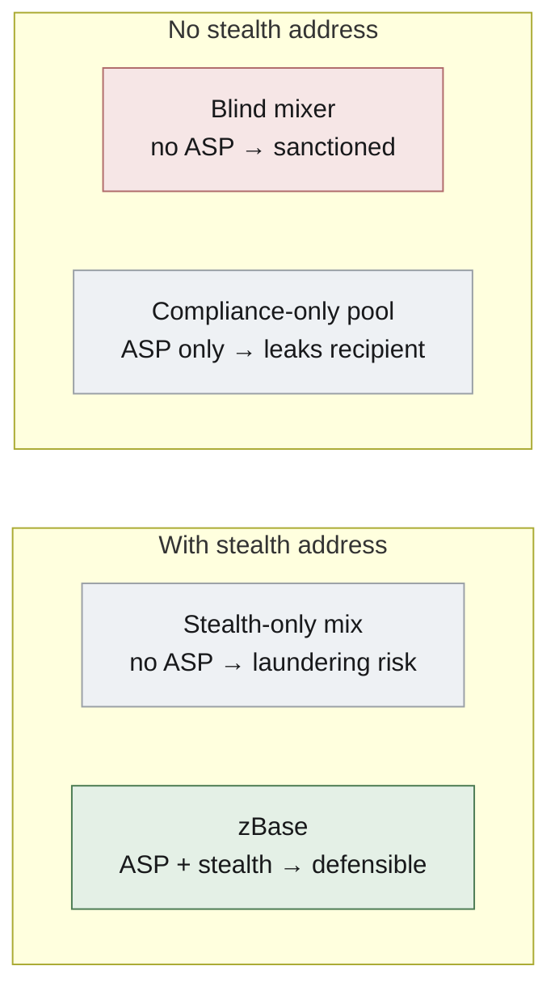

# The two gates — ASP + facilitator policy

TL;DR — a common reviewer question is "if there's a stealth address per call,
why do we still need an ASP?" They solve **opposite problems** and sit at
different lifecycle points (ASP at deposit time, stealth at payment time).
zBase needs both.

## Different parties, different problems

| Layer | Protects against | Stops what |
|---|---|---|
| **ASP** (Gate 1, deposit-time) | The **prosecutor** asking "did you handle sanctioned funds?" | Sanctioned wallet deposits → privately withdraws → laundering. Without ASP, zBase becomes Tornado-Cash-shaped and gets sanctioned. |
| **Facilitator policy** (Gate 2, payment-time) | The **operator's own bad behavior** (or a compromised key) | Approved funds paid to bad destinations. "Approval ≠ unlimited spend." |
| **Stealth address** (per-call, settle-time) | The **competitor / chain analyst** watching the network | "Wallet X paid Nansen $0.50 every 60s — they're running an arbitrage bot using Nansen's premium feed." Provider correlation breaks the pattern. |

## The four-quadrant truth table

Two independent gates → four positions. Columns = **ASP** (off → on); rows = **stealth address**
(off → on). Only zBase has both (bottom-right, green).

## Why you can't merge them

**ASP must operate at deposit time, not payment time.** If you screened every
payment against a sanctions list, you'd need to know who's paying — which
destroys privacy. The ASP design trades a one-time deposit-time check (when the
depositor is still publicly identifiable) for permanent payment-time anonymity.

**Stealth address must operate at payment time, not deposit time.** You don't
know at deposit time which providers the operator will pay. The stealth address
is derived per call from the provider's meta-address — it has nothing to do
with who deposited.

## The honest investor framing

> "Stealth address defeats the attacker. ASP defeats the prosecutor. Privacy
> alone gets us delisted; compliance alone gets us out-competed."

This is also why zBase looks structurally different from both a blind mixer (no
ASP) and a KYC-at-deposit pool (which links identity to funds instead of
screening post-deposit). See the [Trust Model](trust-model.md) for the full comparison.

Next → [Concepts & glossary](concepts-glossary.md)
