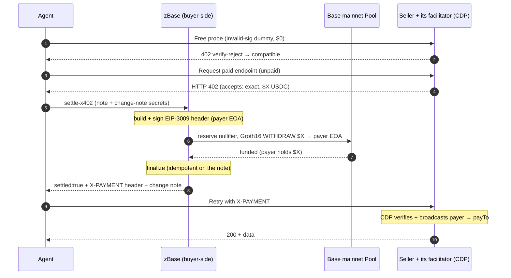

# The x402 facilitator — how settlement happens

Last verified: **2026-07-20** · Network: **Base mainnet** (`eip155:8453`)

TL;DR — zBase lets an x402 agent pay a provider from a privacy pool instead of
sending a direct wallet-to-provider transfer. On Base mainnet the flow supports
exact-amount settlement and returns a seed-recoverable change note when a funded
note has value left. The **seller's own CDP facilitator** verifies and settles the
standard EIP-3009 payment — zBase sits *before* it and never replaces it.

For the architecture-level reasoning behind this design, read
[System architecture](system-architecture.md). For the full narrated run with the
money-safety guarantees behind it, read
[Proven full flow (mainnet)](proven-private-pay-full-flow.md).

!!! info "Two facilitator roles — don't conflate them"
    This page describes zBase's **buyer-side** settlement: it funds a fresh payer from the pool,
    and the **seller keeps its own facilitator** (e.g. Coinbase CDP) to verify and settle the
    standard x402 payment. **Every proven run to date settled through the seller's CDP, not through
    zBase.** zBase *also* ships an **optional seller-side x402 facilitator** (`/x402/verify`,
    `/x402/settle`), but it is **beta** — `/x402/supported` is not yet live, the seller fee is
    recorded-not-enforced, and it has not been proven in production — so it is **not a drop-in
    Coinbase replacement today**.

## Latest verified run (Base mainnet)

A single agent command paid **Nansen's token-screener** (CDP-facilitated, `exact`
scheme, `$0.01`) privately and got HTTP 200 back.

| | value |
|---|---|
| Service | `POST https://api.nansen.ai/api/v1/token-screener` — $0.01 |
| Payer EOA | `0x17fF45F0320d278EDA13989eE95Ad69fbF0C325d` (single-use, no on-chain link to the depositor) |
| `fundingTxHash` | `0x9cabc38638b340a5d248bff822e97ab731df64d611d595df220040893811f548` (public on-chain) |
| Balance delta | exactly **0.010000 USDC**, +1 spent note |
| Delivery | HTTP 200 — Nansen token-screener data |

A second run paid **MetaLend** (`GET`, `$0.001`) the same way — payer
`0x7C2C8709BbB780ae8FCC087707c4F5C45b0b0B0F`, exactly 0.001 USDC spent, HTTP 200.

## Sequence



The free probe spends nothing: a real CDP verifier rejects the dummy with a verify
error (compatible), while a bespoke facilitator returns a generic 402 (incompatible,
refused before any note is touched).

## API fields

Use `zbaseDeposit` in new integrations.

Settle request:

```json
{
  "paymentDetails": {
    "payTo": "0xProviderAddress",
    "maxAmountRequired": "500000"
  },
  "zbaseDeposit": {
    "nullifier": "...",
    "secret": "...",
    "value": "1009800",
    "label": "...",
    "commitment": "..."
  }
}
```

Settle response:

```json
{
  "settled": true,
  "txHash": "0x...",
  "amount": "500000",
  "remainingValue": "509800",
  "nextDeposit": {
    "nullifier": "...",
    "secret": "...",
    "value": "509800",
    "label": "...",
    "commitment": "..."
  }
}
```

The original note is spent after settlement. The change (`nextDeposit`) is also
**re-derivable from your seed**, so a lost response is a re-derivation, not a loss —
see the money-safety contract in [Developer Guides](developer-guides.md#the-result-contract-you-must-handle-money-safety).

## Boundaries

zBase does not claim full anonymity **today**. On mainnet the pool's anonymity set
is still below the k=30 minimum, so a payment settles privately-by-design but is
**not yet crowd-anonymous** — the proven runs above honestly report
`anonymitySet: 2, private: false`, and the agent `--pilot` flag exists to
acknowledge that open-pilot disclosure *before* spending. Privacy compounds as the
pool fills.

The verified claim is that the provider payment is settled from the pool, so the
depositor wallet does not appear as the sender in the provider-payment transaction.

The ASP and postman are centralized today. **Base Sepolia** remains the development
network for the identical flow; mainnet uses the same plain 0xbow pool with mainnet
addresses (see [Contract addresses](contract-addresses.md)).

Next → [Contracts reference](contracts-reference.md)
